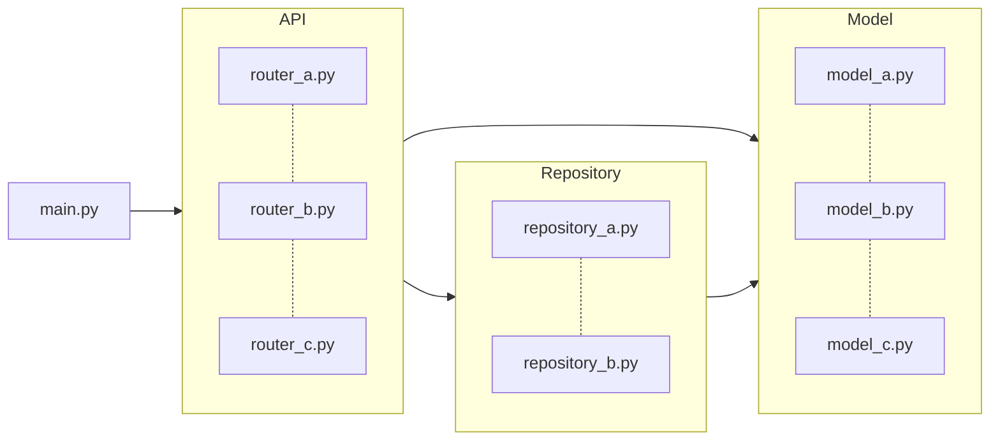

# fastapi-server

## 다이어그램



## 버전 목록
- pyenv : 2.3.35
- python : 3.12.0
- poetry : 1.7.1
- fastapi : 0.109.0
- uvicorn = 0.27.0

## 환경 설정 방법
### 1. pyenv 설치 방법
```brew install pyenv```

### 2. pyenv로 파이썬 버전 설치
```pyenv install 3.12.0```

### 3. pyenv 실행
```pyenv shell 3.12.0```

### 4. poetry 설치 방법
```curl -sSL https://install.python-poetry.org | python3 -```

### 5. poetry 가상환경 실행
```poetry shell```

### 6. poetry에서 패키지 설치
```poetry add fastapi```

### 7. poetry 종료 방법
```exit```

## fastAPI 서버 실행 및 종료 방법

### 1. 실행 방법
```uvicorn main:app --reload```

### 2. 종료 방법
```ctrl + c```
